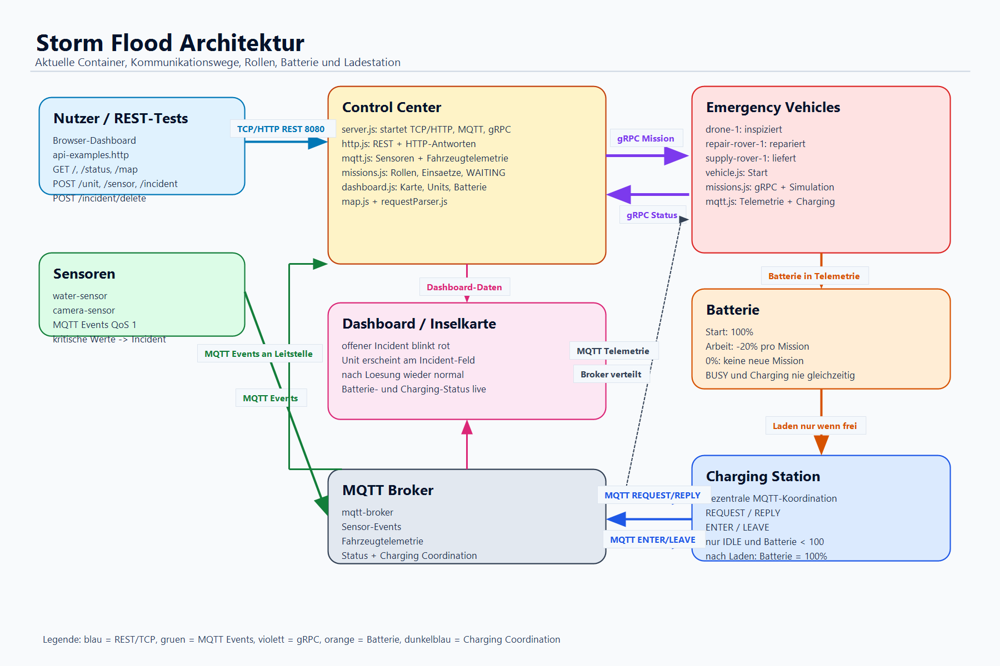
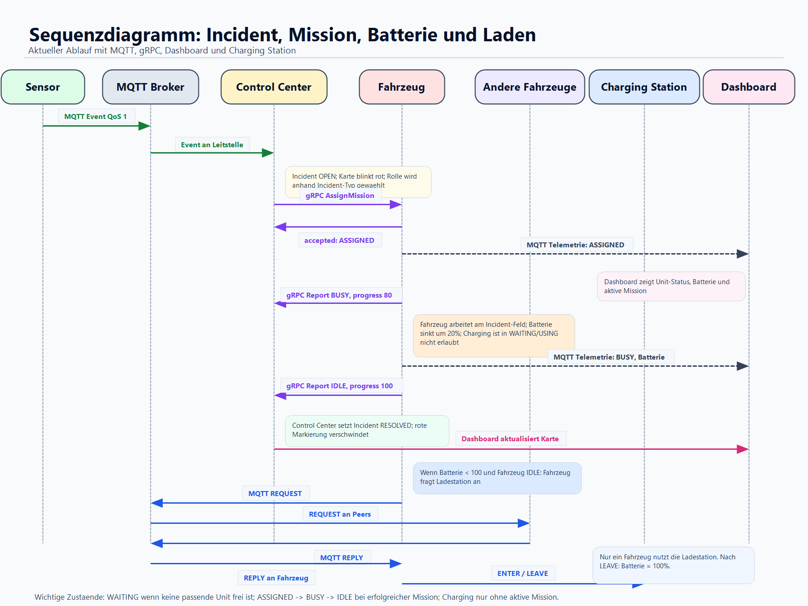

# Architektur

## Containerdiagramm

**Legende:** Durchgezogene Linien zeigen MQTT/HTTP-Datenflüsse, gestrichelte Linien die REST-Registrierung und dicke Linien die gRPC-Einsatzkommunikation. Die Bilder zeigen die Hauptarchitektur; Details wie Batterie- und Ladestationslogik sind darunter textuell ergänzt.

### Kommunikationsübersicht

| Kommunikation | Zweck |
|---|---|
| TCP/HTTP + REST | Registrierung von Sensoren und Fahrzeugen, manuelle Vorfallerzeugung, Löschen von Vorfällen sowie Abfrage von Dashboard, Karte und Status |
| gRPC | Zuweisung von Einsätzen und Rückmeldung des Einsatzstatus |
| MQTT mit QoS 1 | Veröffentlichung von Sensorereignissen, Gefahrenmeldungen, Fahrzeugtelemetrie und Ladestationskoordination |

## Container

| Container | Aufgabe |
|---|---|
| `mqtt-broker` | Mosquitto-Broker für MQTT-Kommunikation |
| `control-center` | Leitstelle mit TCP/HTTP-Server, REST-Endpunkten, Dashboard, MQTT-Handler und gRPC-Missionsvergabe |
| `drone-1` | Einsatzdrohne für Personenerkennung, Wasserstandsalarm und schwer erreichbare Orte |
| `repair-rover-1` | Reparatur-Rover für blockierte Wege, Struktur- und Brückenschäden |
| `supply-rover-1` | Versorgungs-Rover für niedrige Bestände und Materialbedarf |
| `water-sensor` | Simulierter Wassersensor, sendet MQTT-Ereignisse |
| `camera-sensor` | Simulierter Kamerasensor, sendet MQTT-Ereignisse |

## Modulstruktur

### Control Center

| Datei | Aufgabe |
|---|---|
| `server.js` | Startet HTTP/TCP, MQTT und gRPC |
| `http.js` | REST-Routen und HTTP-Antworten |
| `mqtt.js` | MQTT-Verbindung und Verarbeitung von Sensor-/Fahrzeugnachrichten |
| `missions.js` | Vorfälle, Rollenzuordnung, Missionsvergabe und Statusrückmeldungen |
| `dashboard.js` | HTML-Dashboard mit Karte, Units, Incidents, Missions und Charging-Status |
| `map.js` | Inselkarte und Infrastruktur |
| `requestParser.js` | Parsing der TCP/HTTP-Requests |

### Emergency Vehicle

| Datei | Aufgabe |
|---|---|
| `vehicle.js` | Startet ein Fahrzeug |
| `mqtt.js` | Telemetrie, Gefahrenreaktion und Ladestationskoordination |
| `missions.js` | gRPC-Aufträge, Missionssimulation und Batterieverbrauch |
| `config.js` | Rollen, Fähigkeiten und Fahrzeugkonfiguration |

## Einsatz- und Datenfluss

1. Sensoren senden Ereignisse über MQTT.
2. Die Leitstelle filtert und verarbeitet diese Ereignisse.
3. Bei einem relevanten Ereignis entsteht ein Incident.
4. `missions.js` ordnet den Incident einer Rolle zu:
   - `person_detected`, `water_level_alert` oder schwer erreichbare Orte -> `drone`
   - `blocked_route`, `structure_damage`, `bridge_damage` -> `repair_rover`
   - `supply_low`, `material_request` -> `supply_rover`
5. Die Leitstelle vergibt die Mission per gRPC an ein freies passendes Fahrzeug.
6. Das Fahrzeug meldet Fortschritt und Abschluss per gRPC zurück.
7. Zusätzlich sendet das Fahrzeug Telemetrie per MQTT, damit Dashboard und Status aktuell bleiben.
8. Nach Abschluss wird der Incident als gelöst markiert und die rote Markierung verschwindet im Dashboard.

Wenn kein passendes Fahrzeug frei ist, bleibt die Mission zunächst im Zustand `WAITING`. Sobald ein passendes Fahrzeug wieder verfügbar ist, versucht die Leitstelle die wartende Mission erneut zuzuweisen.

## Batterie und Ladestation

Jedes Fahrzeug besitzt einen Batteriestand. Während einer Mission werden aktuell `20%` Batterie verbraucht. Fahrzeuge mit leerer Batterie können keine neue Mission annehmen.

Die Ladestation ist eine gemeinsam genutzte Ressource. Fahrzeuge koordinieren den Zugriff dezentral über MQTT-Nachrichten:

| Nachricht | Bedeutung |
|---|---|
| `REQUEST` | Fahrzeug möchte die Ladestation nutzen |
| `REPLY` | Anderes Fahrzeug erlaubt den Zugriff |
| `ENTER` | Fahrzeug betritt die Ladestation |
| `LEAVE` | Fahrzeug verlässt die Ladestation |

Ein Fahrzeug darf nicht gleichzeitig arbeiten und laden. Es fragt die Ladestation nur an, wenn es frei ist, keine aktive Mission hat und die Batterie nicht voll ist. Nach dem Laden wird die Batterie wieder auf `100%` gesetzt. Die Leitstelle trifft hier keine Ladeentscheidung, sondern beobachtet nur die Koordination und zeigt den Status im Dashboard an.

## Sequenzdiagramm des Einsatzablaufs

Das Diagramm zeigt den zeitlichen Ablauf von einem simulierten Sensorwert bis zur aktualisierten Anzeige im Dashboard. Die Leitstelle filtert MQTT-Nachrichten, erzeugt einen Vorfall, wählt eine Fahrzeugrolle und vergibt den Einsatz per gRPC. Fortschritt und Abschluss werden anschließend über gRPC und MQTT zurückgemeldet. Die zusätzliche Batterie- und Ladestationslogik läuft parallel über die MQTT-Koordination der Fahrzeuge.
