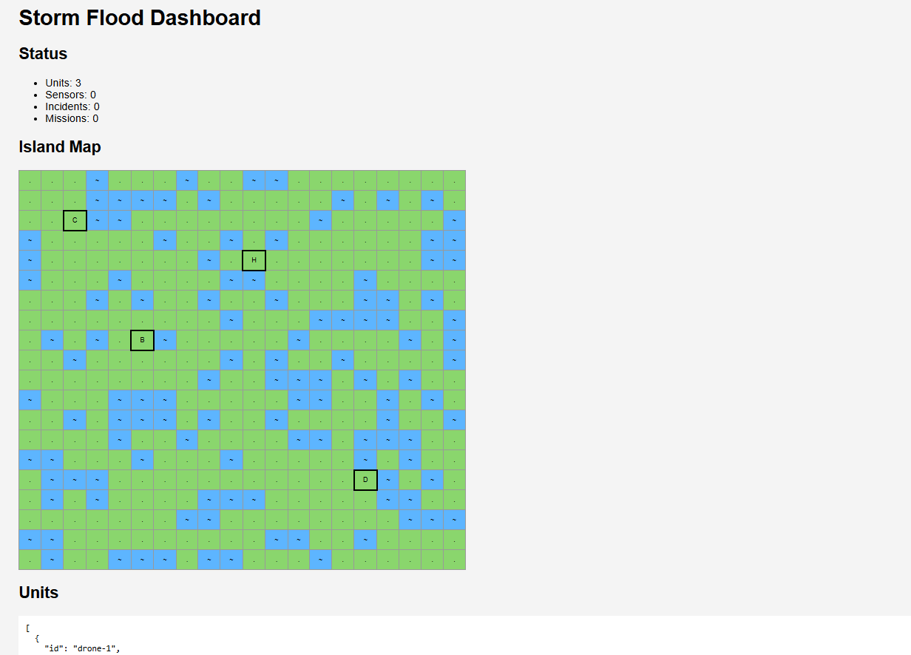

# Testprotokoll

## Allgemeine Angaben

- **Beschreibung:** Leitstelle und Registrierung über Sockets, HTTP und REST
- **Testdatum:** 07.05.2026
- **Basis-URL:** `http://localhost:8080`
- **Start des Systems vor dem Test:** `docker compose up --build -d`

## Test 1 - Manueller REST-Test

**Testtyp:** Funktional, manuell

**Titel:** Prüfung der REST-Endpunkte

**Ziel:** Prüfung der Registrierung, Vorfallerzeugung, Karte, Statusanzeige und HTTP-Fehlerbehandlung.

**Vorbedingungen / Setup:**

- Das System wurde bereits manuell gestartet.
- Die Docker-Container laufen.
- Die Leitstelle ist über Port `8080` erreichbar.
- Die Datei `../tests/rest-tests/api-examples.http` wird mit dem HTTP-Client der IDE ausgeführt.

**Durchführung:**

1. Dashboard, Status und Karte mit `GET /`, `GET /status` und `GET /map` abrufen.
2. Fahrzeuge mit `POST /unit` registrieren.
3. Wasserstands- und Kamerasensor mit `POST /sensor` registrieren.
4. Wasserstandsalarm und Personenerkennung mit `POST /incident` melden.
5. Einen bestehenden Vorfall mit `POST /incident/delete` löschen.
6. Eine unbekannte Route und eine nicht unterstützte Methode aufrufen.

**Erwartetes Ergebnis:**

- GET-Anfragen liefern HTTP `200`.
- Registrierungen und Vorfälle liefern HTTP `201`.
- Das Löschen eines bestehenden Vorfalls liefert HTTP `200`.
- Die Karte besteht aus 20x20 Land- und Wasserfeldern und enthält feste Infrastruktur.
- Eine unbekannte Route liefert HTTP `404`.
- Eine nicht unterstützte Methode liefert HTTP `405`.

**Tatsächliches Ergebnis:**

- Dashboard lieferte HTTP `200`. (GET)

[Dashboard Response File](attachements/2026-06-16T221641.200.html)
- Karte lieferte HTTP `200`. (GET)

[Map Response File](attachements/2026-06-18T013540.200.json)
- Status lieferte HTTP `200`. (GET)
```
{
  "status": "running",
  "units": 0,
  "sensors": 0,
  "incidents": 0
}
```
- Fahrzeug, Sensoren und Vorfälle wurden mit HTTP `201` angenommen.
```
{
  "message": "Unit registered",
  "unit": {
    "id": "supply-1",
    "type": "supply_vehicle",
    "registeredAt": "2026-06-16T20:18:31.461Z"
  }
}
```
```
{
  "message": "Unit registered",
  "unit": {
    "id": "rover-1",
    "type": "rover",
    "registeredAt": "2026-06-16T20:18:29.755Z"
  }
}
```
```
{
  "message": "Sensor registered",
  "sensor": {
    "id": "water-sensor-1",
    "type": "water-level",
    "registeredAt": "2026-06-16T20:18:14.864Z"
  }
}
```
```
{
  "message": "Sensor registered",
  "sensor": {
    "id": "camera-1",
    "type": "camera",
    "registeredAt": "2026-06-16T20:18:18.605Z"
  }
}
```
```
{
  "message": "Incident created",
  "incident": {
    "type": "water_level_alert",
    "sensor": "water-sensor-1",
    "x": 5,
    "y": 7,
    "value": 91,
    "createdAt": "2026-06-16T20:18:23.093Z"
  }
}
```
- Ein bestimmter Vorfall konnte über `POST /incident/delete` gelöscht werden. Dafür wurde die Incident-ID aus der Vorfallliste beziehungsweise aus dem Dashboard verwendet. Diese Funktion wird auch vom Dashboard-Button zum Löschen aktiver Vorfälle genutzt.
```
POST http://localhost:8080/incident/delete
Content-Type: application/json

{
  "id": "incident-1784124645148-4"
}

HTTP/1.1 200 OK
Content-Type: application/json

{
  "message": "Incident deleted",
  "incident": {
    "id": "incident-1784124645148-4"
  }
}
```
- Die Karte enthielt 400 Felder sowie Ladestation, Brücke, Hafen und Depot.
- Das Dashboard wurde im Browser korrekt dargestellt.


  


- Die Fehlerfälle lieferten HTTP `404` beziehungsweise `405`.
```
DELETE http://localhost:8080/unit

HTTP/1.1 405 Method Not Allowed
Content-Type: text/plain
Content-Length: 18
Connection: close

Method Not Allowed
```
```
GET http://localhost:8080/does-not-exist

HTTP/1.1 404 Not Found
Content-Type: text/plain
Content-Length: 15
Connection: close

Route not found
```

**Artefakte / Nachweise:**

- [`../tests/rest-tests/api-examples.http`](../tests/rest-tests/api-examples.http)
- [`../services/control-center`](../services/control-center/server.js)
- [`../services/control-center`](../services/control-center/map.js)

**Bewertung:** PASS

---

## Test 2 - Automatisierter Funktionstest

**Testtyp:** Funktional, automatisiert

**Titel:** Automatisierter Test der wichtigsten REST-Funktionen

**Ziel:** Automatische Prüfung von Statusabfrage, Fahrzeugregistrierung und Vorfallerzeugung.

**Vorbedingungen / Setup:**

- Das System wurde bereits manuell gestartet.
- Die Leitstelle läuft auf `localhost:8080`.

**Durchführung:**

```powershell
node tests/rest-tests/testRunner.js
```

Der Test prüft:

- `GET /status`
- `POST /unit`
- `POST /incident`

**Erwartetes Ergebnis:** Alle drei Tests werden mit `PASS` abgeschlossen.

**Tatsächliches Ergebnis:**

```
=================================
FUNCTIONAL TESTS
=================================

TEST 1: GET /status
PASS

TEST 2: POST /unit
PASS

TEST 3: POST /incident
PASS

Functional tests finished.
```


**Bewertung:** PASS

---

## Test 3 - Lasttest

**Testtyp:** Nicht-funktional, automatisiert

**Titel:** 100 parallele Fahrzeugregistrierungen

**Ziel:** Prüfung der Stabilität der Leitstelle bei mehreren gleichzeitigen Requests.

**Vorbedingungen / Setup:**

- Das System wurde bereits manuell gestartet.
- Die Leitstelle läuft auf `localhost:8080`.

**Durchführung:**

Der Test Runner sendet 100 parallele `POST /unit`-Requests und zählt die erfolgreichen Antworten.

```powershell
node tests/rest-tests/testRunner.js
```

**Erwartetes Ergebnis:** Alle 100 Requests liefern HTTP `201` und der Test endet ohne Fehler.

**Tatsächliches Ergebnis:**

```text
=================================
LOAD TEST
=================================

Requests: 100
Successful: 100
Time: 157 ms

PASS

=================================
ALL TESTS FINISHED
=================================
```

**Bewertung:** PASS

## Gesamtbewertung

Alle dokumentierten Tests wurden erfolgreich abgeschlossen. Die Anforderungen aus Aufgabe 1 wurden sowohl manuell als auch automatisiert geprüft.

---

# Einsatzvergabe über RPC

## Allgemeine Angaben

- **Beschreibung:** Einsatzvergabe via Remote Procedure Call (RPC)
- **Testdatum:** 17.06.2026
- **Basis-URL:** `http://localhost:8080`
- **Start des Systems vor dem Test:** `docker compose up --build -d`

## Test 4 - RPC und Fahrzeugverhalten

**Testtyp:** Funktional, automatisiert

**Titel:** Prüfung der Einsatzvergabe und Fahrzeugzustände

**Ziel:** Prüfung der gRPC-Schnittstelle, Rollenzuordnung und Zustände `ASSIGNED`, `BUSY`, `IDLE` und `WAITING`.

**Vorbedingungen / Setup:** Das System wurde bereits manuell gestartet. Die Leitstelle sowie Drohne, Reparatur-Rover und Versorgungs-Rover laufen über Docker Compose. Die Leitstelle ist über `localhost:8080` und der gRPC-Port über `localhost:50051` erreichbar.

**Durchführung:**

```powershell
node tests/rpc-tests/rpc.test.js
```

Der Test erzeugt passende Einsätze für alle drei Rollen und beobachtet deren Bearbeitung. Zusätzlich wird geprüft, ob ein zweiter Auftrag an eine belegte Rolle in den Zustand `WAITING` geht.

**Erwartetes Ergebnis:** Jeder Einsatz wird der richtigen Rolle zugewiesen. Die Fahrzeuge wechseln von `ASSIGNED` über `BUSY` zurück zu `IDLE` und melden ihr rollenspezifisches Verhalten. Ein belegtes Fahrzeug führt zu einer wartenden Mission mit `WAITING`.

**Tatsächliches Ergebnis:** Alle drei Rollen wurden korrekt gewählt. Die Zustände `ASSIGNED`, `BUSY`, `IDLE` und `WAITING` wurden erfolgreich beobachtet. Abschlussmeldungen wurden von der Leitstelle bestätigt.

**Bewertung:** PASS

## Test 5 - RPC-Antwortzeit

**Testtyp:** Nicht-funktional, automatisiert

**Titel:** Antwortzeit bei 20 RPC-Statusmeldungen

**Ziel:** Prüfung, ob 20 Statusmeldungen zuverlässig und mit weniger als `1000 ms` maximaler Antwortzeit bestätigt werden.

**Vorbedingungen / Setup:** Das System wurde bereits manuell gestartet. Die Leitstelle läuft und der gRPC-Port `50051` ist erreichbar.

**Durchführung:** Der Befehl aus Test 4 sendet zusätzlich 20 aufeinanderfolgende `ReportMissionStatus`-Aufrufe.

**Erwartetes Ergebnis:** Alle Aufrufe werden bestätigt; die maximale Antwortzeit liegt unter `1000 ms`.

**Tatsächliches Ergebnis:** Alle 20 RPC-Aufrufe wurden bestätigt. Die durchschnittliche Antwortzeit betrug `2,8 ms`, die maximale Antwortzeit `4 ms`.

```text
RPC TESTS

PASS: IDL contains both RPC methods and all required mission fields
PASS: drone assignment, behavior and state transitions
PASS: repair_rover assignment, behavior and state transitions
PASS: supply_rover assignment, behavior and state transitions
PASS: busy vehicle causes a WAITING mission
PASS: completion report is acknowledged via gRPC
PASS: 20 RPC reports, average 2.8 ms, maximum 4 ms

ALL RPC TESTS PASSED
```

**Bewertung:** PASS

---

# Ereignisse und Telemetrie über MQTT

## Allgemeine Angaben

- **Beschreibung:** Ereignisse und Telemetrie über Message-oriented Middleware (MQTT)
- **Testdatum:** 18.06.2026
- **MQTT-Broker:** `mqtt://localhost:1883`
- **Basis-URL:** `http://localhost:8080`
- **Start des Systems vor dem Test:** `docker compose up --build -d`

## Test 6 - MQTT-Ereignisverarbeitung

**Testtyp:** Funktional, automatisiert

**Titel:** Prüfung von Ereignissen, Telemetrie und Publisher-Ausfall

**Ziel:** Prüfung der MQTT-Kommunikation, Ereignisfilterung, Fahrzeugtelemetrie, Gefahrenreaktion sowie Publisher-Ausfall.

**Vorbedingungen / Setup:** Das System wurde bereits manuell gestartet. Der MQTT-Broker, die Leitstelle, Sensoren und Fahrzeuge laufen über Docker Compose. Die Ports `1883` und `8080` sind erreichbar.

**Durchführung:**

```powershell
npm run test:mqtt
```

Der Test prüft:

- Erzeugung von Vorfällen aus Schwellwertüberschreitungen
- Ignorieren von Duplikaten und alten Nachrichten
- Zusammenführen gleicher Ereignisse an derselben Position
- Übernahme von Fahrzeugposition und Fortschritt
- Autonome Gefahrenreaktion eines Bodenfahrzeugs
- Ausfall und Neustart eines Publishers
- Verfügbarkeit von `GET /status` und `GET /map`

**Erwartetes Ergebnis:** Gültige Ereignisse und Telemetriedaten werden verarbeitet. Duplikate und alte Nachrichten werden ignoriert. Fahrzeuge reagieren auf Gefahren. Der Publisher-Ausfall wird über MQTT erkannt.

**Tatsächliches Ergebnis:** Alle Ereignisse wurden korrekt verarbeitet. Filterung, Zusammenführung, Telemetrie und Gefahrenreaktion funktionierten. Der Publisher-Ausfall wurde über MQTT Last Will erkannt.

```text
PASS: Broker, GET /status and GET /map are available
PASS: Sensor values create incidents only when the event threshold is exceeded
PASS: Duplicate messages are ignored
PASS: Messages older than 60 seconds are ignored
PASS: Repeated events at the same position are merged
PASS: Vehicle position and progress are updated from MQTT telemetry
PASS: Ground vehicle autonomously adjusts its route for flood hazards
PASS: 50 QoS-1 messages processed in 56 ms
PASS: Publisher failure and restart are detected
```

**Bewertung:** PASS

## Test 7 - MQTT-Lasttest

**Testtyp:** Nicht-funktional, automatisiert

**Titel:** Verarbeitung von 50 MQTT-Nachrichten mit QoS 1

**Ziel:** Prüfung, ob die Leitstelle 50 MQTT-Nachrichten zuverlässig und innerhalb von `10 Sekunden` verarbeitet.

**Vorbedingungen / Setup:** Das System wurde bereits manuell gestartet. Der MQTT-Broker und die Leitstelle laufen. Der Testclient ist mit dem Broker verbunden.

**Durchführung:** Der Befehl aus Test 6 veröffentlicht zusätzlich 50 Nachrichten mit QoS 1 und prüft den Zähler der verarbeiteten Nachrichten über `GET /status`.

**Erwartetes Ergebnis:** Alle 50 Nachrichten werden innerhalb von `10 Sekunden` verarbeitet.

**Tatsächliches Ergebnis:** Alle 50 Nachrichten wurden innerhalb von `50 ms` verarbeitet.

```text
PASS: 50 QoS-1 messages processed in 50 ms

ALL MQTT TESTS PASSED
```

**Bewertung:** PASS

---

# Verteilte Koordination mit Ricart/Agrawala

## Allgemeine Angaben

- **Beschreibung:** Dezentrale Koordination des Zugriffs auf die Ladestation
- **Testdatum:** 02.07.2026
- **MQTT-Broker:** `mqtt://localhost:1883`
- **Basis-URL:** `http://localhost:8080`
- **Start des Systems vor dem Test:** `docker compose up --build -d`

## Test 8 - Batterie und Ladestation

**Testtyp:** Funktional, automatisiert

**Titel:** Prüfung von Batterieverbrauch und Aufladen

**Ziel:** Prüfung, ob Fahrzeuge während der Arbeit Batterie verbrauchen, nicht gleichzeitig arbeiten und laden, und an der Ladestation wieder auf `100%` geladen werden.

**Vorbedingungen / Setup:** Das System wurde bereits manuell gestartet. Die Leitstelle, der MQTT-Broker und die drei Fahrzeuge `drone-1`, `repair-rover-1` und `supply-rover-1` laufen über Docker Compose.

**Durchführung:**

```powershell
npm run test:coordination
```

Der Test erzeugt Einsätze, liest die Fahrzeugzustände aus dem Dashboard und beobachtet Batterie, Arbeitsstatus und Ladezustand.

**Erwartetes Ergebnis:**

- Während der Arbeit sinkt der Batteriestand eines Fahrzeugs.
- Ein Fahrzeug mit Status `BUSY` ist nicht gleichzeitig im Ladezustand `WAITING` oder `USING`.
- Ein Fahrzeug mit Batterie unter `100%` wird an der Ladestation wieder auf `100%` geladen.

**Tatsächliches Ergebnis:** Ein Fahrzeug verbrauchte während der Arbeit Batterie. Während der Beobachtung arbeitete kein Fahrzeug gleichzeitig und lud. Nach der Nutzung der Ladestation wurde die Batterie wieder auf `100%` gesetzt.

```text
PASS: supply-rover-1 uses battery during work (after work 60%)
PASS: vehicles do not work while waiting for or using the charging station
PASS: charging station restores vehicle battery to 100%
```

**Bewertung:** PASS

## Test 9 - Safety und Liveness

**Testtyp:** Funktional, automatisiert

**Titel:** Prüfung des Ricart/Agrawala-Ausschlussverfahrens

**Ziel:** Prüfung, ob die Fahrzeuge die Ladestation dezentral koordinieren und die Anforderungen Safety und Liveness erfüllt sind.

**Vorbedingungen / Setup:** Das System wurde bereits manuell gestartet. Die Leitstelle, der MQTT-Broker und die drei Fahrzeuge `drone-1`, `repair-rover-1` und `supply-rover-1` laufen über Docker Compose.

**Durchführung:**

```powershell
npm run test:coordination
```

Der Test beobachtet die Koordinationsnachrichten über `GET /status`. Dabei werden `REQUEST`, `REPLY`, `ENTER` und `LEAVE` sowie die logischen Zeiten ausgewertet. Der Test erzeugt zusätzlich Einsätze, damit Batterie verbraucht wird und Fahrzeuge die Ladestation anfordern.

**Erwartetes Ergebnis:**

- Mindestens drei Fahrzeuge nehmen an der Koordination teil.
- Es befindet sich nie mehr als ein Fahrzeug gleichzeitig in der kritischen Ressource.
- Ein wartendes Fahrzeug darf nach dem Freigeben der Ladestation weiterarbeiten.

**Tatsächliches Ergebnis:** Alle drei Fahrzeuge nahmen teil. Safety und Liveness wurden erfolgreich beobachtet. Ein automatischer Container-Ausfall wird in diesem Test nicht mehr ausgelöst, weil die Tests vom bereits gestarteten System ausgehen.

```text
PASS: Coordination system is ready and all three vehicles participate
PASS: Safety - no two vehicles used the charging station at the same time
PASS: Liveness - a waiting vehicle entered after another vehicle left
```

**Bewertung:** PASS

## Test 10 - Koordinationslatenz

**Testtyp:** Nicht-funktional, automatisiert

**Titel:** Antwortzeit der dezentralen Koordination

**Ziel:** Prüfung, wie lange ein Zugriff von `REQUEST` bis `ENTER` dauert.

**Vorbedingungen / Setup:** Das System wurde bereits manuell gestartet. Die Fahrzeuge koordinieren den Zugriff auf die Ladestation über MQTT.

**Durchführung:** Der Befehl aus Test 8 misst zusätzlich die Zeit zwischen `REQUEST` und `ENTER`.

**Erwartetes Ergebnis:** Die maximale Koordinationslatenz liegt unter `12000 ms`.

**Tatsächliches Ergebnis:** Es wurde mindestens ein Zugriff gemessen. Die durchschnittliche Latenz betrug `55,0 ms`, die maximale Latenz `55 ms`.

```text
PASS: Non-functional latency - 1 accesses, average 55.0 ms, maximum 55 ms

ALL COORDINATION TESTS PASSED
```

**Bewertung:** PASS
